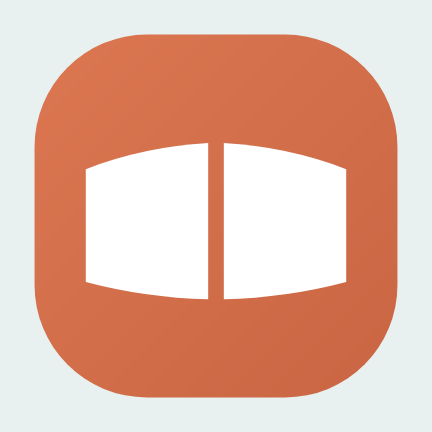

# OLO 디자인 시스템 — 인계 묶음

OLO eBook(이 저장소 `android/`)이 쓰는 디자인을 **다른 앱 세션(Android Cycle 등)에 넘기려고** 모은 것이다.
값은 모두 실제 코드에서 옮겼다. 코드가 원본이고, 이 문서가 코드와 다르면 코드가 맞다.

- 원본 코드: `android/ui-design/src/main/kotlin/io/github/kgcaudit/reader/ui/design/`
  (`CpTheme.kt` 색 · 글자 · 치수, `CpComponents.kt` 부품, `CpIcons.kt` 선 아이콘, `CpCover.kt` 표지)
- 이 시스템의 처음 출처는 같은 사용자의 **OLO Explorer** 앱이다(`kgcaudit/Filezilla-Client` 의
  `docs/OLO-Design-System.md`). OLO eBook 은 그 값을 **바꾸지 않고** 옮겼다 — 여러 앱이 홈 화면에서 한 식구로
  보여야 하기 때문이다. 새 앱도 같은 원칙을 따르면 된다.

| 파일 | 내용 |
|---|---|
| `design-board.png` | 한 장 요약: 밝은 · 어두운 색 토큰, 글자 단계, 치수, 부품 |
| `icon/` | 실행 아이콘(OLO-Design 생성물: 적응형 아이콘 벡터 3개 + 설정) · `preview.png` |
| `screens/` | 앱 시험이 찍은 본보기 화면(시험용 가짜 책만 — 실제 사용자 책은 없다) |

---

## 1. 실행 아이콘

- **적응형 아이콘**(`icon/ic_launcher.xml`): 바탕 · 앞 그림 · 흑백(안드로이드 13 테마 아이콘) 세 겹.
- **원본은 OLO-Design 이다**(kgcaudit/OLO-Design `appicons/launcher.py --app ebook`). 앱은 생성물을 그대로 넣고 손으로
  고치지 않는다(파일 머리 "Do not edit by hand"). 마크를 바꾸려면 디자인 세션에 청한다. 지금 것은 806cabb(0.32.1).
- **바탕**(`ic_launcher_background.xml`): 왼쪽 위가 밝은 클레이 그라데이션 — 계열 모든 앱이 같은 바탕이다.
- **앞 그림**: 먹붓 펼친 책 — 채운 표지 + 붓으로 그린 두 쪽(외곽선 · 줄 글자) + 깊은 책등 접힘. 쪽 안은 비어 바탕이
  비친다. 108 격자에서 안전 원(지름 66) 안에 든다(가장 먼 점 142.9/512, 안전 반지름 156.4).
- 흑백 겹(`ic_launcher_monochrome.xml`)은 앞 그림과 같은 도형이다. 색은 시스템이 입힌다.
- 시험(`AppWalkthroughTest`): 바탕이 주황 · 책등이 흰 획 · 쪽 안이 비어 있음 · 줄 글자 3줄 이상 · 마크 전체가 안전 원 안.

## 2. 색

화면 코드는 **역할 이름만** 쓰고 값은 모른다. 다크 모드는 `CpTheme.kt` 한 곳에서 끝난다.

| 역할 | 쓰임 | 밝은 | 어두운 |
|---|---|---|---|
| `background` | 화면 바탕 | `#F7F4EF` | `#181613` |
| `surface` | 바탕 위 한 겹(메뉴 판) | `#FCFAF6` | `#1C1A16` |
| `dialog` | 팝업 | `#EDE8DF` | `#2B2723` |
| `text` | 본문 글자 | `#1D1A16` | `#E8E3DA` |
| `textMuted` | 보조 글자 | `#574D45` | `#CFC5B9` |
| `divider` | 구분선 | `#D6CCC1` | `#49423A` |
| `outline` | 테두리 단추의 선 | `#8B7F74` | `#978C80` |
| `accent` | 브랜드 클레이 · 강조 | `#B95B3B` | `#E8A183` |
| `accentText` | 강조색 **글자**(값 · 탭 · 링크 · "다 읽음") — 채운 단추는 `accent` | `#9A4A2C` | `#F6C4AE` |
| `onAccent` | 강조 위 글자 | `#FFFFFF` | `#4A1E0C` |
| `accentContainer` | 고른 행 · 고른 칸 바탕 | `#F6E0D6` | `#8A3E22` |
| `onAccentContainer` | 그 위 글자 | `#4A1E0C` | `#FBE0D4` |
| `error` | 지우기 · 오류(크림슨) | `#A50E2E` | `#FFB0BE` |
| `progressTrack` | 진행 막대의 빈 곳 | `#DCD3C6` | `#39434D` |

**타일 색 — 뜻이 있는 색**(목록 앞머리 네모. 쓰는 자리에서 고르지 않는다. 흰 그림을 얹으므로 다크에서 더 밝다)

| 뜻 | 밝은 | 어두운 |
|---|---|---|
| 폴더 | `#B95B3B` | `#D1734F` |
| 문서 · PDF · TXT · 책(EPUB) | `#55606B` | `#6E7A86` |
| 그 밖 | `#7A7168` | `#938A80` |

EPUB 은 색이 아니라 **그림**으로 가른다(0.32.2, 계열 FILEKIND 의 EBOOK): 문서 회청 위에 OLO-Design 의 두 톤 펼친 책
`ic_tile_book.xml` 을 그대로 얹는다(색을 입히지 않는다). 0.32.1 까지 쓴 청록은 계열에서 소스 코드(CODE)의 색이다.

**색을 정한 까닭**(바꾸기 전에 읽을 것)
- 따뜻한 **클레이 브랜드 + 아이보리 웜톤 중립색**. 차가운 회색 위의 따뜻한 강조색은 실수처럼 보인다.
- 클레이는 `#B95B3B`. 처음 값 `#C5613F` 위의 흰 글자가 4.07:1 로 WCAG AA(4.5:1)에 못 미쳐 5% 어둡게 했다.
  대비를 붙드는 시험(`ContrastTest`)이 있다. (아이콘 바탕은 글자가 없어 옛 값 그대로다.)
- 강조색으로 **글자**를 쓸 때는 `accentText`. 브랜드 클레이 글자는 팝업(3.72) · 고른 행(3.58)에서 4.5:1 에 못 미쳐
  글자에만 한 단계 짙게(다크는 밝게) 두었다 — 브랜드 색째 바꾸면 단추가 다른 OLO 앱과 달라진다.
- `error` 는 브랜드와 **색상 자체**를 갈라 크림슨으로 둔다. 이웃한 주황빨강이면 지우기 단추가 브랜드처럼 보인다.
- "다르기만 한 색"(타일)과 "뜻이 있는 색"(역할)을 섞지 않는다.

**리더 지면 테마**(책을 읽을 때만. 라이브러리 화면에는 쓰지 않는다)

| 이름 | 지면 | 글자 | 보조 글자 |
|---|---|---|---|
| 시스템 | 앱 테마를 따름 | | |
| 흰색 | `#FFFFFF` | `#1D1A16` | `#6B625A` |
| 아이보리 | `#F4ECD8` | `#3A2E22` | `#6E5F4E` |
| 세피아 | `#E9DCC0` | `#3B2A1A` | `#6C5842` |
| 회색 | `#DAD8D3` | `#1F1D1A` | `#55504A` |
| 검정 | `#121110` | `#D9D3C9` | `#9C948A` |

앱이 뜨기 전 창 배경(`window_background #F7F4EF`)은 `background` 와 같아야 첫 화면이 번쩍이지 않는다.

## 3. 글자

**시스템 글꼴**을 쓴다(삼성 "글꼴 스타일"을 바꾼 사람에게 앱만 다른 글꼴이면 어색하다. UI 만을 위해 수 MB 를 싣지 않는다).
제목만 줄이고 본문은 Material 크기 — 제목이 크면 팝업이 주변보다 두 배 큰 글자로 뜬다.

| 단계 | 크기 / 줄 높이 | 굵기 | 쓰임 |
|---|---|---|---|
| `title` | 19 / 25sp | 굵게 | 화면 제목 · 팝업 제목 |
| `body` | 16 / 24sp | 보통 | 목록 제목 · 본문 |
| `label` | 14 / 20sp | 굵게 | 갈래 머리 · 단추 · 칩 |
| `subtitle` | 14 / 20sp | 보통 | 부제 · 설명 |
| `caption` | 12 / 16sp | 보통 | 크기 · 날짜 · 작은 표시 |

## 4. 치수

| 이름 | 값 | 비고 |
|---|---|---|
| `gutter` | 16dp | 화면 좌우 여백 |
| `headerHeight` / `rowHeight` | 64dp | 부제가 있는 목록 행 |
| `touchTarget` | 48dp | 누르는 곳은 이보다 작게 만들지 않는다 |
| 모서리 | 6 · 10 · 14 · 18 · 20dp | 글자 꼬리표 · 단추와 칩 · 떠 있는 막대(찾기 결과 · 돌아가기 · 듣기 · 자동 넘김) · 아래 판 · 팝업. 계열(OLO-Design)은 **알약 · 완전 둥근 모양을 쓰지 않는다** — 동그라미는 재생 단추 · 펜 색 점 같은 누르는 표적과 표시에만 |
| `tileSize` / `tileCorner` | 40 / 12dp | 목록 앞머리 네모 |
| `childIndent` | 38dp | 앞머리(아이콘 · 동그라미)가 있는 행의 자식 들여쓰기 |
| `levelIndent` | 16dp | 글자만 있는 행(목차)의 한 단 |

## 5. 부품 (`Cp` 로 시작한다. Material 부품은 쓰지 않는다)

| 부품 | 모양 · 규칙 |
|---|---|
| `CpHeader` | 화면 머리: 제목 + 부제 + 오른쪽 아이콘 단추들 |
| `CpListRow` · `CpTile` | 목록 행: 타일 · 제목 · 부제 · 오른쪽 값. 길게 누르기 지원 |
| `CpRadioRow` | 하나만 고르는 행(왼쪽 동그라미). 고른 상태를 화면 읽기에 알린다(`selectable`) |
| `CpChoice` | 둘셋 중 하나를 고르는 단추 줄(모서리 10dp, 고른 것만 강조색 채움) |
| `CpIconToggle` | 아이콘 두세 칸 전환(격자 \| 목록). 고른 칸만 `accentContainer` 바탕 |
| `CpStepper` | − 값 + |
| `CpTabBar` | 글자 탭, 고른 탭 아래 3dp 강조색 줄 |
| `CpProgressBar` | 얇은(2dp) · 보통(4dp) 진행 막대, 빈 곳은 `progressTrack` |
| `CpButton` | 주(강조색 채움) · 보조(테두리) |
| `CpPopup` | 가운데 판(모서리 20dp, `dialog` 색). 바깥을 누르면 닫힌다 |
| `CpToast` | 아래쪽 짧은 알림 |
| `CpSectionLabel` · `CpDivider` | 갈래 이름 · 구분선 |
| `CpIcons` | 24 격자 **선 아이콘**, 선 굵기 1.8, 둥근 끝 · 둥근 모서리. 찾기 · 새로고침 · 격자 · 목록은 OLO-Design 메뉴 그림(`ic_menu_*`, `icons/control_symbols.py` 생성물 그대로 — 7c5cfd7 부터 선 2.0~2.4 · 일부 채움)을 줄 글자색으로 칠한다 |
| `CpCover` | 책 표지(OLO eBook 전용. 비율 규칙은 아래 6-2) |

## 6. 설계 규칙 (모든 새 화면에 적용)

1. **위계는 들여쓰기로 보인다.** 한 행이 다른 행에 속하면 자식 행은 **부모 행의 글자가 시작하는 자리**에서 시작한다
   (`childIndent` · `levelIndent`). 같은 자리에서 시작하면 같은 급의 선택지로 읽힌다. 같은 급은 들이지 않는다.
   새 목록 화면은 시험에서 좌표로 잰다.
2. **그림은 자르지 않는다.** 칸 크기는 같게, 그림은 원래 비율로 칸 안에 가장 크게, 줄은 밑면을 맞춘다(책꽂이처럼).
3. **대비**: 글자와 바탕은 WCAG AA 4.5:1 이상. 강조색 위 글자도.
4. **다크 모드는 토큰 한 곳에서.** 화면은 역할 이름만 쓴다.
5. **고른 상태는 색만이 아니라 화면 읽기에도 알린다**(`selectable`, 단추마다 이름).
6. **한 줄 권수 · 칸 폭은 화면 폭에서 낸다.** 가로 화면에서 고정 권수로 두면 그림이 화면보다 커진다.

## 7. 작업 방식 (OLO eBook 세션에서 사용자가 정한 것)

- **구상안 이미지 → 결정 · 조정 → 확정 → 코딩.** 구상안은 실제 디자인 부품으로 그려, 구상안과 완성 화면이 다르지
  않게 한다. 선택지는 나란히 보이고 권고안을 표시하며, 결정할 것을 번호로 묻는다. 완성 뒤 확정 구상안과 나란히 대조한다.
- 사용자와의 말은 모두 **우리말**. 코드 주석도 한국어로 "무엇이 아니라 왜".

## 8. 본보기 화면 (`screens/`)

| 파일 | 보이는 것 |
|---|---|
| `100-home-grid.png` · `101-home-list.png` | 홈: 선반 · 격자 · 풍성한 목록 · `CpIconToggle` |
| `11-dark-library.png` | 어두운 테마 |
| `03-reader-first-page.png` · `05-menu-bar.png` | 리더 지면 · 위아래 메뉴 |
| `40-view-panel.png` · `42-view-settings.png` | 보기 판 · 전체 설정(`CpChoice` · `CpStepper`) |
| `41-theme-sepia.png` | 지면 테마(세피아) |
| `14-fonts-added.png` · `82-voices.png` | 위계 들여쓰기(자식 행이 부모 글자 시작선에서) |
| `76-notes.png` · `78-notes-menu.png` | 독서노트 목록 · ⋮ 메뉴 |
